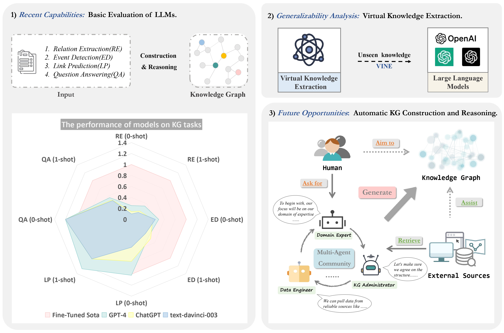

# AutoKG


[](https://github.com/zjunlp/AutoKG) 
[](https://opensource.org/licenses/MIT)
 


Code and Data for the paper "[LLMs for Knowledge Graph Construction and Reasoning: Recent Capabilities and Future Opportunities](Pdf/LLMs_for_Knowledge_Graph_Construction_and_Reasoning__Recent_Capabilities_and_Future_Opportunities1.pdf)"

## 🌄Overview

<div align=center></div>

The overview of our work. There are three main components: 1) ***Basic Evaluation***: detailing our assessment of large models (text-davinci-003, ChatGPT, and GPT-4), in both zero-shot and one-shot settings, using performance data from fully supervised state-of-the-art models as benchmarks; 2) ***Virtual Knowledge Extraction***: an examination of large models' virtual knowledge capabilities on the constructed VINE dataset; and 3) ***Automatic KG***: the proposal of utilizing multiple agents to facilitate the construction and reasoning of KGs.

## 🌟 Evaluation 

### Data Preprocess
 

The datasets that we used in our experiments are as follows:

- KG Construction
  - [DuIE2.0](https://www.luge.ai/#/luge/dataDetail?id=5)
  - [SciERC](http://nlp.cs.washington.edu/sciIE/)
  - [RE-TACRED](https://github.com/gstoica27/Re-TACRED)
  - [MAVEN](https://github.com/THU-KEG/MAVEN-dataset/tree/main)
  
  You can download the dataset from the above address, and you can also find the data used in this experiment directly from the corresponding ***"datas"*** folder like [DuIE2.0](https://github.com/zjunlp/AutoKG/tree/4edd8ad698a1ad3b90abb34d79f299d0e839a28c/KG%20Construction/DuIE2.0/datas).
- KG Reasoning
  - [FB15k-237](https://github.com/zjunlp/Relphormer/tree/main/dataset/fb15k-237)
  - [ATOMIC2020](https://allenai.org/data/atomic-2020)
- Question Answering
  - FreebaseQA
  - MetaQA

The expected structure of files is:

```
AutoKG
 |-- KG Construction
 |    |-- DuIE2.0
 |    |    |-- datas                    #dataset
 |    |    |-- prompts                  #0-shot/1-shot prompts
 |    |    |-- duie_processor.py        #preprocess data
 |    |    |-- duie_prompts.py          #generate prompts
 |	  |--MAVEN
 |    |    |-- datas                    #dataset
 |    |    |-- prompts                  #0-shot/1-shot prompts
 |    |    |-- maven_processor.py       #preprocess data
 |    |    |-- maven_prompts.py         #generate prompts
 |    |--RE-TACRED
 |    |    |-- datas                    #dataset
 |    |    |-- prompts                  #0-shot/1-shot prompts
 |    |    |-- retacred_processor.py    #preprocess data
 |    |    |-- retacred_prompts.py      #generate prompts
 |    |--SciERC
 |    |    |-- datas                    #dataset
 |    |    |-- prompts                  #0-shot/1-shot prompts
 |    |    |-- scierc_processor.py      #preprocess data
 |    |    |-- scierc_prompts.py        #generate prompts
 |-- KG Reasoning (Link Prediction)
 |    |-- FB15k-237
 |    |    |-- data                     #sample data
 |    |    |-- prompts                  #0-shot/1-shot prompts
 |    |-- ATOMIC2020
 |    |    |-- data                     #sample data
 |    |    |-- prompts                  #0-shot/1-shot prompts
 |    |    |-- system_eval              #eval for ATOMIC2020
 
```

### How to Run
 
- **KG Construction**(Use DuIE2.0 as an example)

  ```bash
  cd KG Construction
  python duie_processor.py 
  python duie_prompts.py
  ```

  Then we’ll get 0-shot/1-shot prompts in the folder *“**prompts**”*

- **KG Reasoning**
- **Question Answering**

## 🕵️Virtual Knowledge Extraction

The VINE dataset we built is available  **[here](https://github.com/zjunlp/AutoKG/tree/94d1a9450cc55fc162366f5ba7d7a6d5b54c0236/Virtual%20Knowledge%20Extraction).**

Do the following code to generate prompts:

```bash
cd Virtual Knowledge Extraction
python VINE_processor.py
python VINE_prompts.py
```

## 🤖AutoKG

Our AutoKG code is based on [CAMEL: Communicative Agents for “Mind” Exploration of Large Scale Language Model Society]( https://github.com/lightaime/camel) and a [LangChain](https://python.langchain.com/docs/use_cases/agents/camel_role_playing) implementation of the paper, you can get more details through this link.

- Change the  OPENAI_API_KEY in `Autokg.py`
- Change the  SERPAPI_API_KEY in `RE_CAMEL.py` .( You can get more information in [serpapi](https://python.langchain.com/docs/ecosystem/integrations/serpapi) )

Run the `Autokg.py` script.

```bash
cd AutoKG
python Autokg.py
```

# Citation
If you use the code or data, please cite the following paper:


```bibtex
@article{zhu2023llms,
  title={LLMs for Knowledge Graph Construction and Reasoning: Recent Capabilities and Future Opportunities},
  author={Zhu, Yuqi and Wang, Xiaohan and Chen, Jing and Qiao, Shuofei and Ou, Yixin and Yao, Yunzhi and Deng, Shumin and Chen, Huajun and Zhang, Ningyu},
  journal={arXiv preprint arXiv:2305.13168},
  year={2023}
}
```
