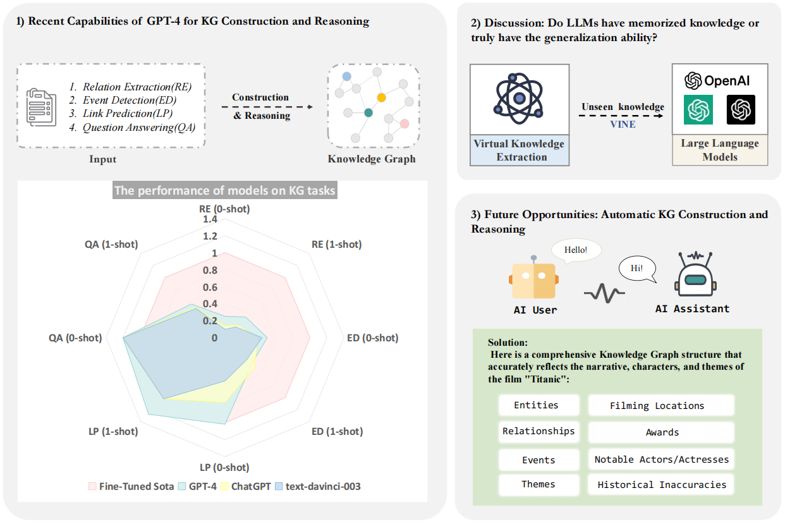

# Auto4KG

---

[](https://github.com/zjunlp/Prompt4ReasoningPapers) [](https://opensource.org/licenses/MIT)  [](https://camo.githubusercontent.com/eafac29b763e18c4d80c680d6a179f348cfa2afbc8d3a45642df19fd580d2404/68747470733a2f2f696d672e736869656c64732e696f2f62616467652f5052732d57656c636f6d652d726564)

Code and Data for the paper "[ChatGPT/GPT-4 for Knowledge Graph Construction and Reasoning: Recent Capabilities and Future Opportunities]( )"

## 🌄Overview



The overview of our work. There are three main components: 1) ***Basic Evaluation***: detailing our assessment of large models(text-davinci-003, ChatGPT, and GPT-4), in both zero-shot and one-shot settings, using performance data from fully supervised state-of-the-art models as benchmarks; 2) ***Virtual Knowledge Extraction***: an examination of large models' virtual knowledge capabilities on the constructed VINE dataset; and 3) ***AutoKG***: the proposal of utilizing multiple agents to facilitate the construction and reasoning of knowledge graphs.

## 🌟 Evaluation 

### Data Preprocess

The datasets that we used in our experiments are as follows:

- KG Construction
  - DuIE2.0
  - SciERC
  - RE-TACRED
  - MAVEN
- KG Reasoning
  - FB15k-237
  - ATOMIC2020
- Question Answering
  - FreebaseQA
  - MetaQA

The expected structure of files is:

```
AutoKG
 |-- KG Construction
 |    |-- DuIE2.0
 |    |    |-- datas                #dataset
 |    |    |-- prompts              #0-shot/1-shot prompts
 |    |    |-- duie_processor.py    #preprocess data
 |    |    |-- duie_prompts.py      #generate prompts
 |	  |--MAVEN
 |    |    |-- datas                #dataset
 |    |    |-- prompts              #0-shot/1-shot prompts
 |    |    |-- maven_processor.py   #preprocess data
 |    |    |-- maven_prompts.py     #generate prompts
 |    |--RE-TACRED
 |    |    |-- datas                    #dataset
 |    |    |-- prompts                  #0-shot/1-shot prompts
 |    |    |-- retacred_processor.py    #preprocess data
 |    |    |-- retacred_prompts.py      #generate prompts
 |    |--SciERC
 |    |    |-- datas                    #dataset
 |    |    |-- prompts                  #0-shot/1-shot prompts
 |    |    |-- scierc_processor.py      #preprocess data
 |    |    |-- scierc_prompts.py        #generate prompts
 
```

### How to Run

- **KG Construction**(Use DuIE2.0 as an example)

  ```bash
  cd KG Construction
  python duie_processor.py 
  python duie_prompts.py
  ```

  Then we’ll get 0-shot/1-shot prompts in the folder *“**prompts**”*

- **KG Reasoning**
- **Question Answering**

## 🕵️Virtual Knowledge Extraction

The VINE dataset we built can be retrieved from the folder “***datas***”

Do the following code to generate prompts:

```bash
cd Virtual Knowledge Extraction
python VINE_processor.py
python VINE_prompts.py
```

##🤖AutoKG-main

Our AutoKG code is based on [CAMEL: Communicative Agents for “Mind” Exploration of Large Scale Language Model Society]( https://github.com/lightaime/camel) , you can get more details through this link.

- Change the  OPENAI_API_KEY in `role_playing.py`

Run the `role_playing.py` script.

```bash
cd AutoKG-main
python role_playing.py
```

